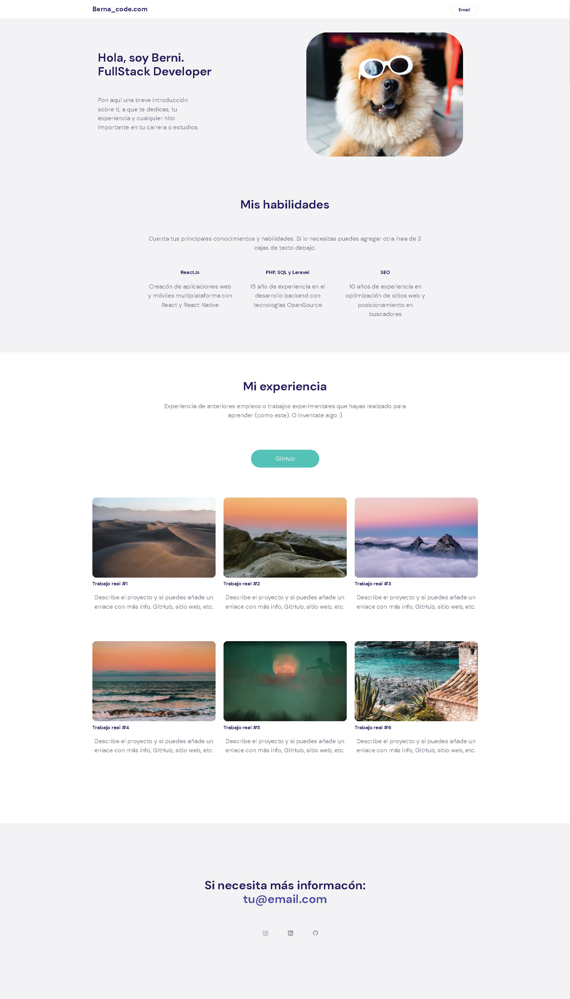
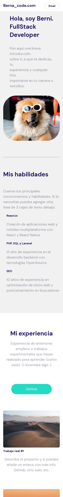
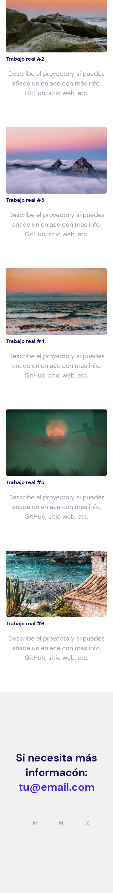

# Challenge from Holajuniors.com

By chance i saw a video of a youtuber who promised to start uploading html and css challenges. I decided to start making them just to practice.

This is the option "B" of challenge #1 on Holajuniors.com .

https://www.figma.com/file/XYCezVsLUacSEwva4XfQQp/Reto-HolaJuniors-%231---Opción-B?node-id=1%3A13

## Live Demo:

https://jade-cheesecake-10650c.netlify.app

## Desktop:

## Mobile:
